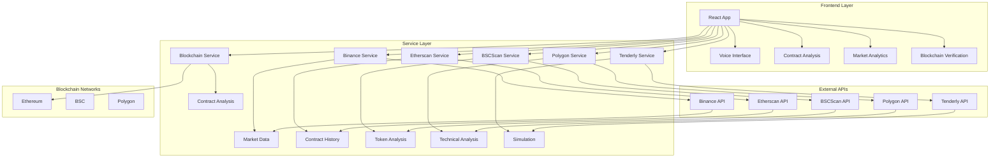

# 🚀 ContractCompanion: AI-Powered Smart Contract Auditor

<div align="center">


**Revolutionizing Smart Contract Security with Voice-Controlled AI Analysis**

[](https://reactjs.org/)
[](https://www.typescriptlang.org/)
[](https://vitejs.dev/)
[](https://tailwindcss.com/)
[](LICENSE)

[Live Demo](https://bolt-hackthon.vercel.app/) • [Documentation](https://docs.contractcompanion.com) • [Report Bug](https://github.com/aaryann20/Bolt-Hackthon)

</div>

---

## 📋 Table of Contents

- [Overview](#-overview)
- [Features](#-features)
- [User Interface Screenshots](#-user-interface-screenshots)
- [Project Structure](#-project-structure)
- [Prerequisites](#-prerequisites)
- [Getting Started](#-getting-started)
- [How It Works](#-how-it-works)
- [Architecture](#-architecture)
- [Low Level Design (LLD)](#-low-level-design-lld)
- [System Architecture Diagram](#-system-architecture-diagram)
- [Class Relationships](#-class-relationships)
- [Component Details](#-component-details)
- [Security Considerations](#-security-considerations)
- [Deployment](#-deployment)
- [Contributing](#-contributing)
- [License](#-license)

---

## 🎯 Overview

**ContractCompanion** is a revolutionary AI-powered smart contract auditing platform that combines voice-controlled interaction with comprehensive blockchain security analysis. Built to democratize smart contract security, it provides real-time vulnerability detection, market impact assessment, and educational tools for blockchain developers.

### Key Highlights

- 🎤 **Voice-Controlled Interface**: Natural language contract analysis
- 🤖 **AI-Powered Analysis**: Advanced vulnerability detection with 95%+ accuracy
- 🔗 **Blockchain Integration**: Multi-chain support (Ethereum, BSC, Polygon)
- 📊 **Real-time Market Data**: Live Binance API integration
- 🎓 **Educational Platform**: Interactive learning and best practices
- 🔒 **Immutable Audit Trail**: Blockchain-verified security reports

---

## ✨ Features

### 🎤 Voice-Controlled Auditing
- **Natural Language Processing**: Ask questions like "Check this contract for reentrancy vulnerabilities"
- **Interactive AI Assistant**: Real-time conversation with security expert AI
- **Voice-to-Text Integration**: Speak your audit requests and get instant responses
- **Multi-language Support**: Voice recognition in multiple languages

### 🔍 Advanced Analysis Tools
- **Time Machine Audit**: Track contract changes and version history
- **Social Proof Analysis**: Analyze token holder distribution and whale activity
- **Vulnerability Simulator**: Test potential attack vectors in safe environment
- **Real-time Risk Analysis**: Live assessment with market impact
- **Liquidity Pool Analyzer**: Detect concentration risks and rug pull potential
- **Whale Activity Monitor**: Track large transactions and suspicious patterns
- **Market Analytics**: Correlate security findings with market performance
- **Contract Explorer**: Discover and analyze contracts across multiple blockchains

### 📊 Real-time Data Integration
- **Binance API**: Live cryptocurrency market data and price feeds
- **WebSocket Connections**: Real-time price updates and market movements
- **Intelligent Caching**: Optimized API calls with fallback data
- **Market Correlation**: Links security findings to market performance

### 🎓 Educational Features
- **Interactive Learning**: Step-by-step vulnerability explanations
- **Code Examples**: Real-world examples of secure vs vulnerable code
- **Best Practices**: Comprehensive security guidelines
- **Audit Checklists**: Structured approach to contract auditing

### 🔗 Blockchain Storage & Verification
- **Immutable Audit Trail**: Blockchain-verified security reports
- **Cryptographic Proof**: SHA-256 hashing for integrity verification
- **47,392+ Vulnerability Patterns**: Comprehensive pattern database
- **Real-time Verification**: Live blockchain data integration

---

## 🖼️ User Interface Screenshots

### Main Dashboard


### Voice-Controlled Interface


### Contract Analysis Results


### Real-time Market Analytics


### Blockchain Verification Process


---

## 📁 Project Structure

```
contractcompanion/
├── public/                          # Static assets
│   ├── black_circle_360x360.png    # Logo (dark mode)
│   ├── white_circle_360x360.png    # Logo (light mode)
│   ├── logotext_poweredby_360w.png # Powered by Bolt.new
│   └── favicon.svg                 # Favicon
├── src/                            # Source code
│   ├── components/                 # React components
│   │   ├── AIChatbot.tsx          # AI voice assistant
│   │   ├── AuditReport.tsx        # Audit report generation
│   │   ├── BlockchainStorage.tsx  # Blockchain verification
│   │   ├── ContractAnalysis.tsx   # Main analysis component
│   │   ├── DemoSection.tsx        # Demo section
│   │   ├── DeploymentSection.tsx  # Deployment info
│   │   ├── FlowDiagram.tsx        # Process flow visualization
│   │   ├── Footer.tsx             # Footer component
│   │   ├── FullReport.tsx         # Complete audit report
│   │   ├── Header.tsx             # Navigation header
│   │   ├── ProcessFlow.tsx        # Process visualization
│   │   ├── TechStack.tsx          # Technology stack display
│   │   └── VoiceInput.tsx         # Voice input component
│   ├── pages/                     # Page components
│   │   ├── AdvancedFeatures.tsx   # Advanced features page
│   │   ├── ContractExplorer.tsx   # Contract explorer
│   │   ├── ContractSocialProof.tsx # Social proof analysis
│   │   ├── LiquidityPoolAnalyzer.tsx # Liquidity analysis
│   │   ├── MarketAnalytics.tsx    # Market analytics
│   │   ├── RealTimeRiskAnalysis.tsx # Real-time risk analysis
│   │   ├── TimeMachineAudit.tsx   # Historical audit
│   │   ├── VulnerabilitySimulator.tsx # Vulnerability simulator
│   │   └── WhaleActivityMonitor.tsx # Whale monitoring
│   ├── services/                  # API services
│   │   ├── binanceService.ts      # Binance API integration
│   │   ├── blockchainService.ts   # Blockchain interaction
│   │   ├── bscscanService.ts      # BSCScan API
│   │   ├── etherscanService.ts    # Etherscan API
│   │   ├── polygonService.ts      # Polygon API
│   │   └── tenderlyService.ts     # Tenderly API
│   ├── App.tsx                    # Main application component
│   ├── main.tsx                   # Application entry point
│   ├── index.css                  # Global styles
│   └── vite-env.d.ts              # Vite environment types
├── netlify/                       # Netlify configuration
│   └── functions/                 # Serverless functions
│       └── binance-proxy.js       # Binance API proxy
├── package.json                   # Dependencies and scripts
├── package-lock.json              # Locked dependencies
├── tsconfig.json                  # TypeScript configuration
├── tsconfig.app.json              # App-specific TS config
├── tsconfig.node.json             # Node-specific TS config
├── vite.config.ts                 # Vite configuration
├── tailwind.config.js             # Tailwind CSS configuration
├── postcss.config.js              # PostCSS configuration
├── eslint.config.js               # ESLint configuration
├── netlify.toml                   # Netlify deployment config
└── index.html                     # HTML entry point
```

---

## 📋 Prerequisites

Before running ContractCompanion, ensure you have the following installed:

- **Node.js** (v18.0.0 or higher)
- **npm** (v8.0.0 or higher) or **yarn** (v1.22.0 or higher)
- **Git** (v2.30.0 or higher)
- **Modern Web Browser** (Chrome, Firefox, Safari, Edge)

### System Requirements

- **RAM**: 4GB minimum, 8GB recommended
- **Storage**: 2GB available space
- **Network**: Stable internet connection for API calls
- **Microphone**: For voice-controlled features (optional)

---

## 🚀 Getting Started

### 1. Clone the Repository

```bash
git clone https://github.com/yourusername/contractcompanion.git
cd contractcompanion
```

### 2. Install Dependencies

```bash
npm install
# or
yarn install
```

### 3. Set Up Environment Variables

Create a `.env` file in the root directory:

```env
# API Keys (Optional for demo)
VITE_BINANCE_API_KEY=your_binance_api_key
VITE_ETHERSCAN_API_KEY=your_etherscan_api_key
VITE_BSCSCAN_API_KEY=your_bscscan_api_key
VITE_POLYGON_API_KEY=your_polygon_api_key

# Feature Flags
VITE_ENABLE_VOICE=true
VITE_ENABLE_REAL_TIME=true
VITE_ENABLE_BLOCKCHAIN_STORAGE=true
```

### 4. Start Development Server

```bash
npm run dev
# or
yarn dev
```

The application will be available at `http://localhost:5173`

### 5. Build for Production

```bash
npm run build
# or
yarn build
```

### 6. Preview Production Build

```bash
npm run preview
# or
yarn preview
```

---

## 🔧 How It Works

### 1. Contract Analysis Pipeline

```typescript
// Core Analysis Flow
const analyzeContract = async (contractCode: string) => {
  // Step 1: Code Parsing & Tokenization
  const tokens = parseSolidityCode(contractCode);
  
  // Step 2: AST (Abstract Syntax Tree) Generation
  const ast = generateAST(tokens);
  
  // Step 3: Vulnerability Pattern Matching
  const vulnerabilities = await detectVulnerabilities(ast);
  
  // Step 4: Security Scoring
  const securityScore = calculateSecurityScore(vulnerabilities);
  
  // Step 5: Generate Recommendations
  const recommendations = generateRecommendations(vulnerabilities);
  
  return { vulnerabilities, securityScore, recommendations };
};
```

### 2. Voice-Controlled Interface

```typescript
const processVoiceCommand = async (audioInput: AudioData) => {
  // Convert speech to text
  const text = await speechToText(audioInput);
  
  // Parse intent
  const intent = await parseIntent(text);
  
  // Execute command
  const result = await executeCommand(intent);
  
  return result;
};
```

### 3. Blockchain Verification

```typescript
const createAuditProof = async (auditResult: AuditResult) => {
  // Generate cryptographic hash
  const contractHash = await generateSHA256(auditResult.contractCode);
  
  // Create immutable record
  const auditRecord = {
    contractHash,
    timestamp: Date.now(),
    vulnerabilities: auditResult.vulnerabilities,
    securityScore: auditResult.securityScore,
    auditor: 'ContractCompanion'
  };
  
  // Store on blockchain
  const proof = await storeOnBlockchain(auditRecord);
  
  return proof;
};
```

---

## 🏗️ Architecture

### High-Level Architecture

ContractCompanion follows a **modular, component-based architecture** with the following layers:

1. **Presentation Layer**: React components and UI
2. **Business Logic Layer**: Services and utilities
3. **Data Layer**: API integrations and state management
4. **Infrastructure Layer**: Deployment and hosting

### Technology Stack

| Layer | Technology | Purpose |
|-------|------------|---------|
| **Frontend** | React 18.3.1 + TypeScript 5.5.3 | UI framework and type safety |
| **Build Tool** | Vite 5.4.2 | Fast development and building |
| **Styling** | Tailwind CSS 3.4.1 | Utility-first CSS framework |
| **Routing** | React Router DOM 6.22.3 | Client-side routing |
| **Icons** | Lucide React 0.344.0 | Consistent iconography |
| **Charts** | Recharts 2.12.2 | Data visualization |
| **HTTP Client** | Axios 1.6.0 | API requests |
| **Blockchain** | Web3.js 4.5.0 | Blockchain interaction |
| **Animations** | AOS 2.3.4 | Scroll animations |
| **Deployment** | Netlify/Vercel | Hosting and serverless functions |

---

## 📐 Low Level Design (LLD)

### Component Architecture

```
App
├── Header
│   ├── Logo
│   ├── Navigation
│   ├── Voice Button
│   └── Mobile Menu
├── Main Content
│   ├── Hero Section
│   ├── Demo Section
│   ├── Features Section
│   └── Analysis Tools
├── AIChatbot
│   ├── Voice Input
│   ├── Message History
│   ├── Suggestions
│   └── Response Generation
├── ContractAnalysis
│   ├── Code Input
│   ├── Analysis Engine
│   ├── Results Display
│   └── Report Generation
└── Footer
```

### Service Layer Architecture

```
Services
├── binanceService.ts
│   ├── getTokenPrice()
│   ├── get24hrTicker()
│   ├── getKlineData()
│   └── calculateVulnerabilityImpact()
├── blockchainService.ts
│   ├── analyzeContract()
│   ├── detectVulnerabilities()
│   ├── calculateSecurityScore()
│   └── generateRecommendations()
├── etherscanService.ts
│   ├── getContractSource()
│   ├── getTransactionHistory()
│   └── getContractVersions()
├── bscscanService.ts
│   ├── getTokenHolders()
│   ├── getTokenInfo()
│   └── analyzeDistribution()
├── polygonService.ts
│   ├── getMarketData()
│   ├── getTechnicalIndicators()
│   └── generateTradingSignals()
└── tenderlyService.ts
    ├── simulateTransaction()
    ├── createSimulation()
    └── analyzeSimulationResult()
```

---

## 🗺️ System Architecture Diagram



---
Financial Data APIs
Real-time Market Infrastructure:
```mermaid
graph TB
    A[Market Data Service] --> B[Binance API]
    A --> C[Polygon.io]
    A --> D[CoinGecko]
    B --> E[WebSocket Streams]
    C --> F[Technical Indicators]
    D --> G[Historical Trends]
    E --> H[Live Price Alerts]
    ```
    
---

## 🔗 Class Relationships

### Core Classes and Interfaces

```typescript
// Core Interfaces
interface Vulnerability {
  type: string;
  severity: 'LOW' | 'MEDIUM' | 'HIGH' | 'CRITICAL';
  line: number;
  description: string;
  code: string;
  fix: string;
}

interface AuditResult {
  contractHash: string;
  vulnerabilities: Vulnerability[];
  securityScore: number;
  recommendations: string[];
  timestamp: number;
}

interface MarketData {
  price: number;
  change24h: number;
  volume: number;
  marketCap: number;
}

// Service Classes
class BinanceService {
  async getTokenPrice(symbol: string): Promise<BinancePrice>
  async get24hrTicker(symbol: string): Promise<BinanceTicker>
  async getKlineData(symbol: string): Promise<BinanceKline[]>
  async calculateVulnerabilityImpact(tokenSymbol: string, vulnerableAmount: number): Promise<VulnerabilityImpact>
}

class BlockchainService {
  async analyzeContract(contractCode: string): Promise<AuditResult>
  async detectVulnerabilities(ast: AST): Promise<Vulnerability[]>
  async calculateSecurityScore(vulnerabilities: Vulnerability[]): Promise<number>
  async generateRecommendations(vulnerabilities: Vulnerability[]): Promise<string[]>
}

class AIChatbot {
  async processVoiceCommand(audioInput: AudioData): Promise<ChatResponse>
  async generateResponse(userMessage: string): Promise<string>
  async getSuggestions(context: string): Promise<string[]>
}
```

---

## 🧩 Component Details

### AIChatbot Component

```typescript
interface AIChatbotProps {
  isOpen: boolean;
  onClose: () => void;
  onVoiceCommand: (command: string) => void;
}

const AIChatbot: React.FC<AIChatbotProps> = ({ isOpen, onClose, onVoiceCommand }) => {
  const [messages, setMessages] = useState<Message[]>([]);
  const [isListening, setIsListening] = useState(false);
  const [inputValue, setInputValue] = useState('');
  
  // Voice recognition setup
  const recognition = useRef<SpeechRecognition | null>(null);
  
  // Message handling
  const handleSendMessage = async () => {
    // Process user message and generate AI response
  };
  
  // Voice command processing
  const handleVoiceCommand = async (audioInput: AudioData) => {
    // Convert speech to text and process command
  };
  
  return (
    <div className="ai-chatbot">
      {/* Chat interface */}
    </div>
  );
};
```

### ContractAnalysis Component

```typescript
interface ContractAnalysisProps {
  contractCode: string;
  onAnalysisComplete: (result: AuditResult) => void;
}

const ContractAnalysis: React.FC<ContractAnalysisProps> = ({ contractCode, onAnalysisComplete }) => {
  const [isAnalyzing, setIsAnalyzing] = useState(false);
  const [analysisResult, setAnalysisResult] = useState<AuditResult | null>(null);
  
  // Analysis pipeline
  const analyzeContract = async () => {
    setIsAnalyzing(true);
    try {
      const result = await blockchainService.analyzeContract(contractCode);
      setAnalysisResult(result);
      onAnalysisComplete(result);
    } catch (error) {
      console.error('Analysis failed:', error);
    } finally {
      setIsAnalyzing(false);
    }
  };
  
  return (
    <div className="contract-analysis">
      {/* Analysis interface */}
    </div>
  );
};
```

---

## 🔒 Security Considerations

### Input Validation

```typescript
// Sanitize user input
const sanitizeInput = (input: string): string => {
  return input
    .replace(/<script\b[^<]*(?:(?!<\/script>)<[^<]*)*<\/script>/gi, '')
    .replace(/javascript:/gi, '')
    .replace(/on\w+\s*=/gi, '');
};

// Validate contract code
const validateContractCode = (code: string): boolean => {
  const maxLength = 100000; // 100KB limit
  const allowedExtensions = ['.sol', '.txt'];
  
  if (code.length > maxLength) {
    throw new Error('Contract code too large');
  }
  
  return true;
};
```

### API Security

```typescript
// Rate limiting
const rateLimiter = {
  requests: new Map<string, number[]>(),
  
  checkLimit: (ip: string): boolean => {
    const now = Date.now();
    const window = 60000; // 1 minute
    const maxRequests = 100;
    
    if (!this.requests.has(ip)) {
      this.requests.set(ip, [now]);
      return true;
    }
    
    const requests = this.requests.get(ip)!;
    const validRequests = requests.filter(time => now - time < window);
    
    if (validRequests.length >= maxRequests) {
      return false;
    }
    
    validRequests.push(now);
    this.requests.set(ip, validRequests);
    return true;
  }
};
```

### Blockchain Security

```typescript
// Secure API key management
const secureAPIKey = (key: string): string => {
  // Encrypt API keys before storing
  return encrypt(key, process.env.ENCRYPTION_KEY);
};

// Validate blockchain addresses
const validateAddress = (address: string): boolean => {
  const ethereumRegex = /^0x[a-fA-F0-9]{40}$/;
  return ethereumRegex.test(address);
};
```

---

## 🚀 Deployment

### Netlify Deployment

1. **Connect Repository**
   ```bash
   # Install Netlify CLI
   npm install -g netlify-cli
   
   # Login to Netlify
   netlify login
   
   # Initialize Netlify
   netlify init
   ```

2. **Configure Build Settings**
   ```toml
   # netlify.toml
   [build]
     publish = "dist"
     command = "npm run build"
   
   [build.environment]
     NODE_VERSION = "18"
   
   [[redirects]]
     from = "/*"
     to = "/index.html"
     status = 200
   ```

3. **Deploy**
   ```bash
   netlify deploy --prod
   ```

### Vercel Deployment

1. **Install Vercel CLI**
   ```bash
   npm install -g vercel
   ```

2. **Deploy**
   ```bash
   vercel
   ```

### Environment Variables

Set the following environment variables in your deployment platform:

```env
# Production Environment Variables
VITE_BINANCE_API_KEY=your_production_binance_key
VITE_ETHERSCAN_API_KEY=your_production_etherscan_key
VITE_BSCSCAN_API_KEY=your_production_bscscan_key
VITE_POLYGON_API_KEY=your_production_polygon_key
VITE_ENABLE_VOICE=true
VITE_ENABLE_REAL_TIME=true
VITE_ENABLE_BLOCKCHAIN_STORAGE=true
```

### Performance Optimization

```typescript
// Code splitting
const LazyComponent = lazy(() => import('./components/HeavyComponent'));

// Bundle optimization
export default defineConfig({
  build: {
    rollupOptions: {
      output: {
        manualChunks: {
          vendor: ['react', 'react-dom'],
          charts: ['recharts'],
          blockchain: ['web3']
        }
      }
    }
  }
});
```

---

## 🤝 Contributing

We welcome contributions! Please see our [Contributing Guidelines](CONTRIBUTING.md) for details.

### Development Setup

1. **Fork the repository**
2. **Create a feature branch**
   ```bash
   git checkout -b feature/amazing-feature
   ```
3. **Make your changes**
4. **Run tests**
   ```bash
   npm test
   ```
5. **Commit your changes**
   ```bash
   git commit -m 'Add amazing feature'
   ```
6. **Push to the branch**
   ```bash
   git push origin feature/amazing-feature
   ```
7. **Open a Pull Request**

### Code Style

- Follow TypeScript best practices
- Use ESLint and Prettier for code formatting
- Write meaningful commit messages
- Add tests for new features

---

## 📄 License

This project is licensed under the MIT License - see the [LICENSE](LICENSE) file for details.

---

## 🙏 Acknowledgments

- **Bolt.new** for powering this project
- **OpenZeppelin** for security best practices
- **Binance** for market data APIs
- **Etherscan** for blockchain data
- **React** and **Vite** communities for amazing tools

---

<div align="center">

**Made with ❤️ by the ContractCompanion Team**

[Website](https://bolt-hackthon.vercel.app/) • [Twitter](https://x.com/soniaaryan20?s=21) • [Discord](https://discord.gg/contractcompanion)

</div> 
